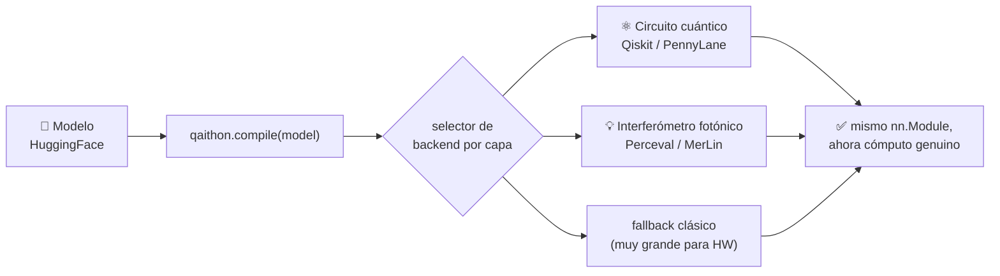
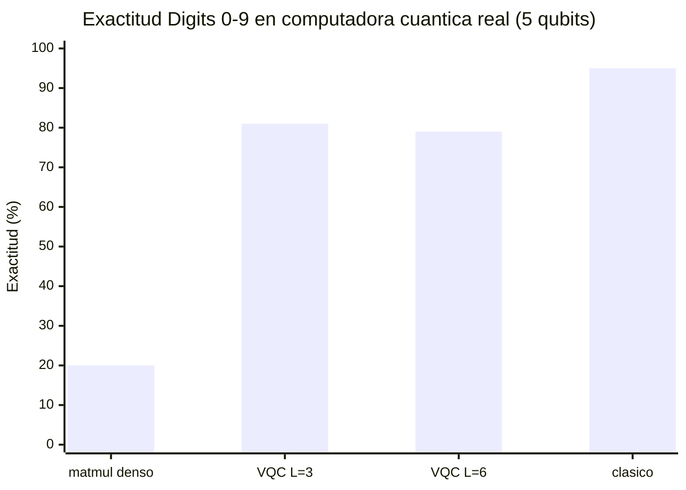
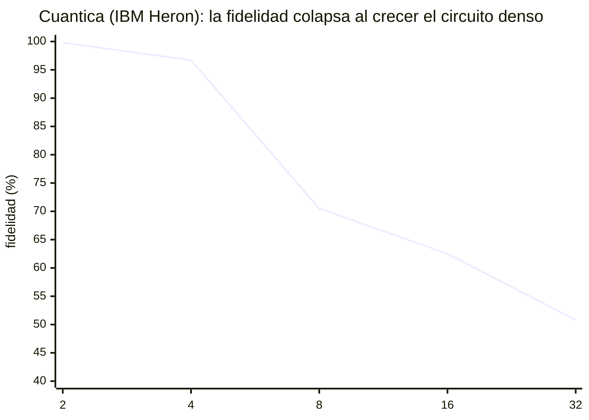
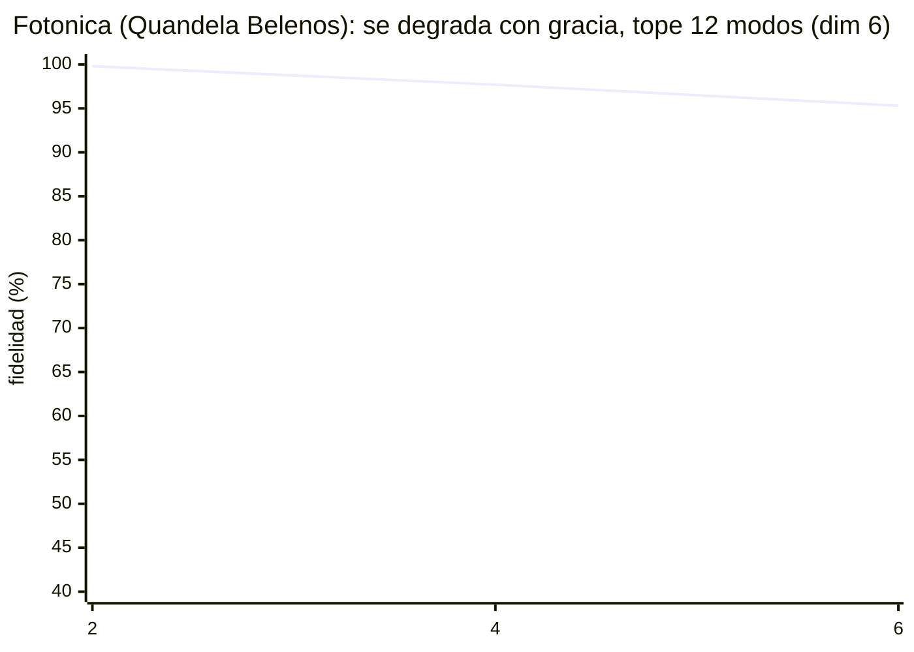

<div align="center">

# ⚛️ Qaithon 💡

### Corré transformers pequeños con **computación cuántica y fotónica genuina**

Qaithon conecta PyTorch / HuggingFace con algoritmos cuánticos y fotónicos reales
— validado en **dos QPUs físicas**, muy por debajo de la escala de los LLMs de hoy.
Un paso honesto y reproducible en la frontera IA × cuántica × fotónica.


**[English](README.md) · [Español](README.es.md)**

</div>

---

## ✨ Qué es

Escribís código PyTorch / HuggingFace normal. `qaithon.compile(model)` recorre la
red, reemplaza las capas lineales sustituibles por versiones cuyos matmuls corren
con un **algoritmo cuántico o fotónico genuino**, y te devuelve el mismo `nn.Module`.

```python
import qaithon
from transformers import AutoModelForCausalLM

model = AutoModelForCausalLM.from_pretrained("roneneldan/TinyStories-1M")
model = qaithon.compile(model, backends=("pennylane.sim",))  # cuántico genuino
outputs = model.generate(input_ids, max_new_tokens=50)
```

Los matmuls corren el **circuito real** (Perceval/MerLin fotónica, Qiskit/PennyLane
qubits) — no matemática clásica con etiqueta cuántica. Solo los transformers
**tiny** corren genuinos hoy; el *por qué* es física, explicado abajo — con números medidos.

## 🔭 Cómo funciona



---

## 📊 Resultados — medidos en hardware real

Los kernels genuinos de Qaithon corrieron en **dos QPUs físicas**: la Heron
superconductora de IBM y la Belenos fotónica de Quandela. Cada número está medido,
y es reproducible desde `scripts/`.

### 🧠 Una red neuronal clasificó en una computadora cuántica real

La inferencia de un clasificador lineal corrió en IBM Heron (`ibm_marrakesh`, 3 qubits):

<div align="center">

| métrica | resultado |
|---|:---:|
| Exactitud en **hardware cuántico físico** (Iris) | **100%** (21/21) 🎯 |
| Exactitud clásica | 100% |
| Fidelidad de distribución (medida vs ideal) | 0.932 |

</div>

Los números crudos cargan ~7% de ruido y aun así cada flor se clasificó bien — la
decisión `argmax` sobrevive aunque la aritmética tiemble.

### ⚙️ El algoritmo importa más que el número de qubits

Mismos dígitos manuscritos de 10 clases, mismos **5 qubits**, en hardware real de
IBM — solo cambió el motor:



| motor (5 qubits, Digits 0–9) | compuertas | exactitud en HW real |
|---|:---:|:---:|
| matmul denso (circuito profundo) | ~5.880 | 20% _(≈ azar)_ |
| VQC re-uploading superficial — `qaithon.ReuploadingClassifier` | ~230 | **~80%** ✅ |
| línea base clásica | — | ~95% |

> Un matmul denso profundo se ahoga en ruido; un **circuito superficial NISQ-nativo**
> mantiene ~80% en los mismos qubits. El motor, no el número de qubits, es la decisión.

### 🔬 Matmul genuino — fotónica vs cuántica, ambas en hardware real

Fidelidad del resultado medido vs el ideal, a medida que crece la matriz:





<div align="center">

| dim de matriz | Cuántica · IBM Heron | Fotónica · Quandela Belenos |
|:---:|:---:|:---:|
| 2 | 0.998 | 0.998 |
| 4 | 0.967 | **0.977** |
| 6 | — | 0.953 |
| 8 | 0.705 | — _(necesita >12 modos)_ |

</div>

La fotónica **iguala o supera** a la cuántica a escala baja y se degrada *con
gracia*; la cuántica tiene más margen de tamaño pero el **ruido** la colapsa más
rápido. **Límites opuestos — medidos, no afirmados.**

### 🛡️ Mitigación de errores por software

`mitigation=True` (mejor layout + dynamical decoupling + measurement twirling)
*rescata un circuito al borde*, pero no mueve el muro:

| tarea | qubits | sin | con mitigación |
|---|:---:|:---:|:---:|
| Iris (8 features) | 4 | 71.4% | **85.7%** ✅ |
| Digits (10 clases) | 5 | 20% | 20% _(muy profundo — gana el ruido)_ |

### 📝 Un modelo de lenguaje real en circuitos cuánticos genuinos (simulador)

El preentrenado **TinyStories-1M** generó texto coherente — *"…una niña llamada
Lily a la que le gustaba jugar al sol…"* — con sus **48 capas lineales** computadas
por circuitos de qubits genuinos. Salida **idéntica** al clásico (error 1e-6,
argmax 100%). En un simulador de laptop, totalmente reproducible.

---

## 🧠 ¿Por qué solo modelos pequeños?

Dos muros duros — **física, no ingeniería**:

#### 1. Simular cuántica es *exponencial* — cada qubit duplica la memoria

<div align="center">

| qubits | números (2ⁿ) | RAM del simulador |
|:---:|:---:|:---:|
| 10 | 1.024 | kilobytes |
| 20 | ~1 millón | ~16 MB |
| **30** | ~1.000 millones | **~16 GB — llena un laptop** |
| 40 | ~1 billón | ~16 TB — un clúster |
| **45–50** | ~10¹⁵ | **una supercomputadora** |

</div>

Así que en una máquina normal solo podés correr genuinamente circuitos **pequeños**
— transformers tiny como TinyStories-1M. Una capa a escala GPT-2 ya necesita más
que un laptop; los LLMs reales quedan muy lejos.

#### 2. El hardware cuántico real es *ruidoso*

Hoy solo ~**4–5 qubits** son usables para un cómputo denso antes de que domine el
ruido (medido arriba). Las corridas físicas son de juguete.

> *Sí* hay conexión real con HuggingFace — cargás modelos como siempre — pero solo
> los tiny corren genuinos; los más grandes cargan y sus capas grandes caen a
> clásico. El hardware mejora cada año, y Qaithon está hecho para crecer con él: el
> mismo `compile()` alcanzará modelos más grandes a medida que los qubits sean más
> baratos y limpios.

---

## ⚖️ Dos límites opuestos

La razón de que siga pequeño es **opuesta** para cada tecnología:

<div align="center">

| | 💡 Fotónica | ⚛️ Cuántica |
|---|---|---|
| **Cómo escala** | 1 carril de luz por número (lineal) | 2ⁿ números en n qubits (exponencial) |
| **Hardware real** | diminuto — Belenos: 12 modos ≈ dim 6 | grande — IBM: 156 qubits |
| **Simulador** | sobra (256 modos ≈ dim 128) | se queda corto (~30 qubits en laptop) |
| **El muro** | número de modos | ruido (profundidad) |
| **En el chip real** | exacta y con gracia | ruidosa y colapsa |

</div>

> 🅿️ **Analogía.** La fotónica es un parqueadero con un espacio por carro — se llena
> rápido. La cuántica es un edificio donde cada piso nuevo *duplica* el cupo — pocos
> pisos, muchísimo espacio, pero la luz parpadea (ruido).

---

## 🗺️ Qué corre dónde

| dónde | qué corre genuino |
|---|---|
| 🔴 **Hardware cuántico real** (hoy) | ~4–5 qubits → circuitos de juguete y clasificadores tiny |
| 💻 **Simulador en laptop** | transformers tiny (TinyStories-1M); dim ≤ 1024 cuántico / ≤ 128 fotónico |
| 🖥️ **Simulador en máquina grande** | hasta capas ~escala GPT-2 (memoria exponencial) |
| ❌ **LLMs reales** (Llama/Mistral/…) | no factible genuino hoy — _el estimador de qubits te muestra por qué_ |

---

## 🔌 Backends

| Vendor | Dispositivo | Tipo | Backend | HW real | Simulador |
|---|---|---|---|:---:|:---:|
| IBM | Heron (156 qubits) | superconductor | `ibm.heron` | ✅ **corrió** | `ibm.aer` |
| Quandela | Belenos (12 modos) | fotónico | `quandela.belenos` | ✅ **corrió** | `quandela.perceval` |
| Quandela | MerLin | fotónico (autograd) | `quandela.merlin` | — | ✅ |
| AWS Braket | IonQ Forte | ion atrapado | `aws.braket.ionq` | 💲 pago por shot | — |
| AWS Braket | QuEra Aquila | átomo neutro (analógico) | `aws.braket.quera` | 💲 pago por shot | — |
| AWS Braket | SV1 | simulador (nube) | `aws.braket.sv1` | — | ✅ |
| Xanadu | PennyLane | varios | `pennylane.sim` | vía plugins | ✅ |
| TuringQ | DeepQuantum | multi | `deepquantum` | — | ✅ |

Capas genuinas entrenables: `qaithon.PhotonicLayer`, `qaithon.QuantumLayer`,
`qaithon.ReuploadingClassifier`. Tres modos en los backends reales: `profile`
(gratis), `calibrate` (telemetría real), `execute` (matmul genuino en la QPU).

---

## ⚡ Instalar · Configurar · Correr

```bash
pip install qaithon[huggingface,pennylane,quandela,deepquantum]
```

```python
import qaithon
qaithon.configure(ibm_token="...", quandela_token="...", huggingface_token="hf_...")
qaithon.config.status()   # {'ibm': True, 'quandela': True, ...} — solo booleanos
```

```python
# Correr un modelo tiny genuino en un simulador cuántico
from transformers import AutoModelForCausalLM, AutoTokenizer
tok = AutoTokenizer.from_pretrained("EleutherAI/gpt-neo-125M")
model = AutoModelForCausalLM.from_pretrained("roneneldan/TinyStories-1M")
model = qaithon.compile(model, backends=("pennylane.sim",))
print(tok.decode(model.generate(**tok("Once upon a time", return_tensors="pt"),
                                max_new_tokens=20)[0]))
```

```bash
qaithon list-backends   # backends registrados + disponibilidad
qaithon doctor          # diagnostica el entorno
qaithon inspect gpt2    # análisis: ¿qué haría compile()? (no lo corre)
```

---

## 🔁 Reproducir los resultados

| script | qué corre |
|---|---|
| `scripts/run_hardware_experiments.py` | IBM: curva de colapso, clasificador Iris, A/B de mitigación |
| `scripts/run_vqc_hardware.py` | IBM: VQC re-uploading superficial en Digits 10 clases (5 qubits) |
| `scripts/run_photonic_hardware.py` | Quandela Belenos: matmul fotónico genuino (1 fotón) |

Todos necesitan un token gratis de IBM Quantum / un token de Quandela; envían jobs reales.

---

## 🚀 Roadmap

Los circuitos genuinos ya corren en QPUs reales hoy — la conexión, los kernels y el
ruteo funcionan de punta a punta. Lo que impide correr *modelos* es **ruido y
escala**, justo lo que arregla la corrección de errores. El hardware corregido con
**qubits lógicos ya existe** (la Helios de Quantinuum). A medida que crezcan los
qubits lógicos y baje el error de compuerta, las curvas de colapso de arriba se
corren a la derecha — y el mismo `qaithon.compile(model)` llega más lejos.
**Clónalo, córrelo, empuja los límites.**

---

<div align="center">

Licencia MIT · Research preview · por **Fabián Bautista** · `fabbagar83@gmail.com`

</div>
