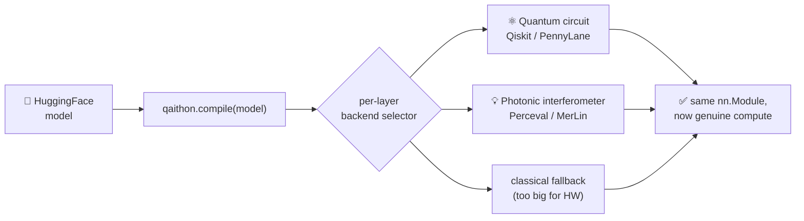
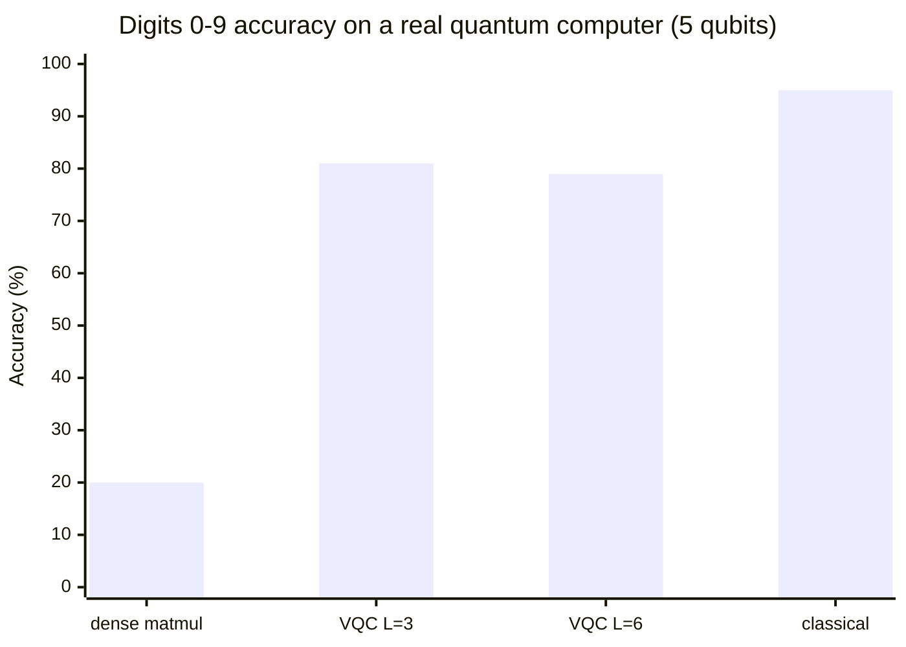
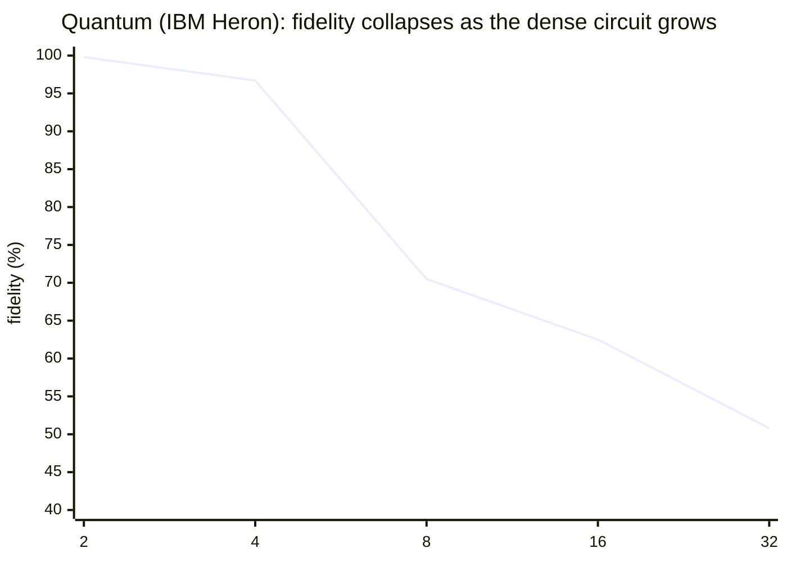
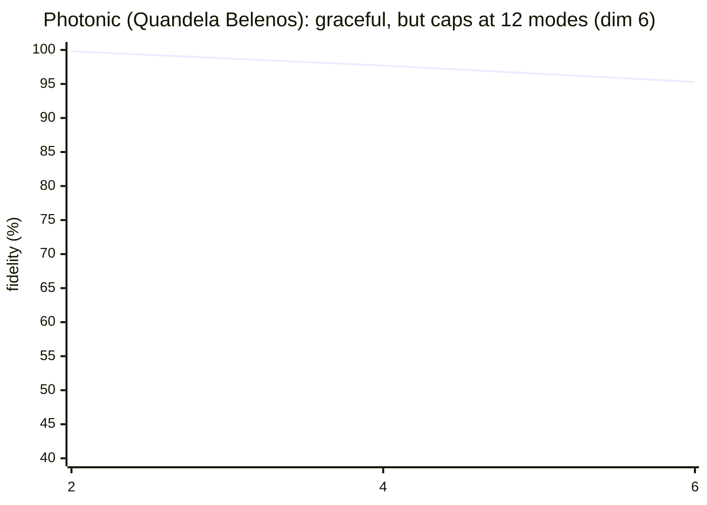

<div align="center">

# ⚛️ Qaithon 💡

### Run small transformers through **genuine quantum & photonic computing**

Qaithon connects PyTorch / HuggingFace to real quantum and photonic algorithms —
validated on **two physical QPUs**, far below the scale of today's LLMs.
An honest, reproducible step at the AI × quantum × photonics frontier.


**[English](README.md) · [Español](README.es.md)**

</div>

---

## ✨ What it is

You write regular PyTorch / HuggingFace code. `qaithon.compile(model)` walks the
network, swaps replaceable linear layers for versions whose matmuls run on a
**genuine quantum or photonic algorithm**, and hands back the same `nn.Module`.

```python
import qaithon
from transformers import AutoModelForCausalLM

model = AutoModelForCausalLM.from_pretrained("roneneldan/TinyStories-1M")
model = qaithon.compile(model, backends=("pennylane.sim",))  # genuine quantum
outputs = model.generate(input_ids, max_new_tokens=50)
```

The matmuls run on the **real circuit** (Perceval/MerLin photonics, Qiskit/PennyLane
qubits) — not classical math with a quantum label. Only **tiny** transformers run
genuinely today; the *why* is physics, explained below — with measured numbers.

## 🔭 How it works



---

## 📊 Results — measured on real hardware

Qaithon's genuine kernels have run on **two physical QPUs**: IBM's superconducting
**Heron** and Quandela's photonic **Belenos**. Every number below is measured, and
reproducible from `scripts/`.

### 🧠 A neural network classified on a real quantum computer

A linear classifier's inference ran on IBM Heron (`ibm_marrakesh`, 3 qubits):

<div align="center">

| metric | result |
|---|:---:|
| Accuracy on **physical quantum hardware** (Iris) | **100%** (21/21) 🎯 |
| Classical accuracy | 100% |
| Distribution fidelity (measured vs ideal) | 0.932 |

</div>

The raw numbers carry ~7% noise, yet every flower was classified correctly — an
`argmax` decision survives even when the arithmetic wobbles.

### ⚙️ The algorithm matters more than the qubit count

**The task:** classify handwritten digits **0–9** (scikit-learn's `load_digits`,
8×8 images, reduced with PCA) into 10 classes — all at **5 qubits on the real IBM
QPU `ibm_marrakesh`**. We compared two *engines* for the model's compute:



| engine (5 qubits, Digits 0–9) | gates | accuracy on real HW |
|---|:---:|:---:|
| dense matmul (forces a classical weight matrix through the QPU) | ~5,880 | 20% _(≈ chance)_ |
| shallow re-uploading VQC — `qaithon.ReuploadingClassifier` (quantum-native) | ~230 | **~80%** ✅ |
| classical baseline (same classifier on a CPU) | — | ~95% |

What ran in each row:
- **Dense matmul** — embeds the weight matrix in one big dense circuit (~5,880
  gates). The noise destroys it → 20% (random is 10%). Software mitigation could
  *not* rescue it (still ~20% — the circuit is simply too deep).
- **Re-uploading VQC** — a *quantum-native* shallow circuit (~230 gates) that
  encodes the data and is trained as a classifier. It survives the noise → ~80%.
- **Classical** — the reference, run on a normal CPU.

> A deep dense matmul drowns in noise; a **shallow, NISQ-native algorithm** keeps
> ~80% on the same qubits. The engine, not the qubit count, is the binding choice.

### 🔬 Genuine matmul — photonic vs quantum, both on real hardware

Fidelity of the measured result vs the ideal, as the matrix grows:





<div align="center">

| matrix dim | Quantum · IBM Heron | Photonic · Quandela Belenos |
|:---:|:---:|:---:|
| 2 | 0.998 | 0.998 |
| 4 | 0.967 | **0.977** |
| 6 | — | 0.953 |
| 8 | 0.705 | — _(needs >12 modes)_ |

</div>

Photonics **matches or beats** quantum at small scale and degrades *gracefully*;
quantum has more size headroom but **noise** collapses it faster. **Opposite
limits — measured, not claimed.**

### 🛡️ Software error mitigation

`mitigation=True` (better layout + dynamical decoupling + measurement twirling)
*rescues a borderline circuit*, but can't move the wall:

| task | qubits | without | with mitigation |
|---|:---:|:---:|:---:|
| Iris (8 features) | 4 | 71.4% | **85.7%** ✅ |
| Digits (10-class) | 5 | 20% | 20% _(too deep — loss wins)_ |

### 📝 A real language model on genuine quantum circuits (simulator)

Pretrained **TinyStories-1M** generated coherent text — *"…a little girl named
Lily. She loved to play outside in the sunshine…"* — with its **48 linear layers**
computed through genuine qubit circuits. Output **identical** to classical (error
1e-6, argmax 100%). On a laptop simulator, fully reproducible.

---

## 🧠 Why only small models?

Two hard walls — **physics, not engineering**:

#### 1. Simulating quantum is *exponential* — each qubit doubles the memory

<div align="center">

| qubits | numbers held (2ⁿ) | simulator RAM |
|:---:|:---:|:---:|
| 10 | 1,024 | kilobytes |
| 20 | ~1 million | ~16 MB |
| **30** | ~1 billion | **~16 GB — fills a laptop** |
| 40 | ~1 trillion | ~16 TB — a server cluster |
| **45–50** | ~10¹⁵ | **a supercomputer** |

</div>

So on a normal machine you can only genuinely run **small** circuits — tiny
transformers like TinyStories-1M. A GPT-2-scale layer already needs more than a
laptop; real LLMs are far out of reach.

#### 2. Real quantum hardware is *noisy*

Today only ~**4–5 qubits** are usable for a dense computation before noise
dominates (measured above). Physical runs are toy-sized.

> There **is** a real HuggingFace connection — you load models the usual way — but
> only tiny ones run genuinely; larger models load and their oversized layers fall
> back to classical. The hardware improves every year, and Qaithon is built to grow
> with it: the same `compile()` call reaches bigger models as qubits get cheaper
> and cleaner.

---

## ⚖️ Two opposite limits

The reason it stays small is **opposite** for each technology:

<div align="center">

| | 💡 Photonic | ⚛️ Quantum |
|---|---|---|
| **How it scales** | 1 lane of light per number (linear) | 2ⁿ numbers in n qubits (exponential) |
| **Real hardware** | tiny — Belenos: 12 modes ≈ dim 6 | big — IBM: 156 qubits |
| **Simulator** | over-provisions (256 modes ≈ dim 128) | falls short (~30 qubits on a laptop) |
| **The wall** | number of modes | noise (gate depth) |
| **On the real chip** | exact & graceful | noisy & collapses |

</div>

> 🅿️ **Analogy.** Photonics is a parking lot with one space per car — it fills up
> fast. Quantum is a garage where each new floor *doubles* the capacity — few
> floors, enormous room, but the lights flicker (noise).

---

## 🗺️ What runs where

| where | what runs genuinely |
|---|---|
| 🔴 **Real quantum hardware** (today) | ~4–5 qubits → toy circuits & tiny classifiers |
| 💻 **Laptop simulator** | tiny transformers (TinyStories-1M); dim ≤ 1024 quantum / ≤ 128 photonic |
| 🖥️ **Big-machine simulator** | up to ~GPT-2-scale layers (exponential memory) |
| ❌ **Real LLMs** (Llama/Mistral/…) | not feasible genuinely today — _the qubit-estimator shows you why_ |

---

## 🔌 Backends

| Vendor | Device | Type | Backend | Real HW | Simulator |
|---|---|---|---|:---:|:---:|
| IBM | Heron (156 qubits) | superconductor | `ibm.heron` | ✅ **ran** | `ibm.aer` |
| Quandela | Belenos (12 modes) | photonic | `quandela.belenos` | ✅ **ran** | `quandela.perceval` |
| Quandela | MerLin | photonic (autograd) | `quandela.merlin` | — | ✅ |
| AWS Braket | IonQ Forte | trapped ion | `aws.braket.ionq` | 💲 pay-per-shot | — |
| AWS Braket | QuEra Aquila | neutral atom (analog) | `aws.braket.quera` | 💲 pay-per-shot | — |
| AWS Braket | SV1 | simulator (cloud) | `aws.braket.sv1` | — | ✅ |
| Xanadu | PennyLane | various | `pennylane.sim` | via plugins | ✅ |
| TuringQ | DeepQuantum | multi | `deepquantum` | — | ✅ |

Genuine layers you can train: `qaithon.PhotonicLayer`, `qaithon.QuantumLayer`,
`qaithon.ReuploadingClassifier` (the quantum-native classifier behind the
5-qubit Digits result). Three execution modes on real backends: `profile` (free),
`calibrate` (real telemetry), `execute` (genuine matmul on the QPU — IBM,
Quandela, AWS SV1/IonQ).

**See what a real run did.** After `mode="execute"`, every backend records the
run's telemetry — what it returned and how much compute it cost:

```python
be = IBMHeronBackend(mode="execute", mitigation=True, shots=2048)
y = be.matmul(x, weight)
print(be.last_execute)
# {'device': 'ibm_marrakesh', 'n_qubits': 3, 'n_gates': 290, 'shots': 2048,
#  'fidelity': 0.967, 'latency_s': 6.6, 'mitigation': True}
print(be.last_circuit_latency_us)   # wall-clock of the last real circuit
```

---

## ⚡ Install · Configure · Run

```bash
pip install qaithon[huggingface,pennylane,quandela,deepquantum]
```

```python
import qaithon
qaithon.configure(ibm_token="...", quandela_token="...", huggingface_token="hf_...")
qaithon.config.status()   # {'ibm': True, 'quandela': True, ...} — booleans only
```

```python
# Run a tiny model genuinely on a quantum simulator
from transformers import AutoModelForCausalLM, AutoTokenizer
tok = AutoTokenizer.from_pretrained("EleutherAI/gpt-neo-125M")
model = AutoModelForCausalLM.from_pretrained("roneneldan/TinyStories-1M")
model = qaithon.compile(model, backends=("pennylane.sim",))
print(tok.decode(model.generate(**tok("Once upon a time", return_tensors="pt"),
                                max_new_tokens=20)[0]))
```

```bash
qaithon list-backends   # registered backends + availability
qaithon doctor          # diagnose the environment
qaithon inspect gpt2    # analysis: what would compile() do? (does not run it)
```

---

## 🔁 Reproduce the results

| script | what it runs |
|---|---|
| `scripts/run_hardware_experiments.py` | IBM: matmul collapse curve, Iris classifier, mitigation A/B |
| `scripts/run_vqc_hardware.py` | IBM: shallow re-uploading VQC on 10-class Digits (5 qubits) |
| `scripts/run_photonic_hardware.py` | Quandela Belenos: genuine photonic matmul (single photon) |

All need a free IBM Quantum token / a Quandela token; they submit real jobs.

---

## 🚀 Roadmap

Genuine circuits already run on real QPUs today — the connection, the kernels and
the routing all work end-to-end. What stops us from running *models* is **noise
and scale**, exactly what error correction fixes. Error-corrected hardware with
**logical qubits already exists** (Quantinuum's Helios). As logical qubits grow and
gate error drops, the collapse curves above shift right — and the same
`qaithon.compile(model)` reaches further. **Clone it, run it, push the limits.**

---

<div align="center">

MIT licensed · Research preview · by **Fabián Bautista** · `fabbagar83@gmail.com`

</div>
